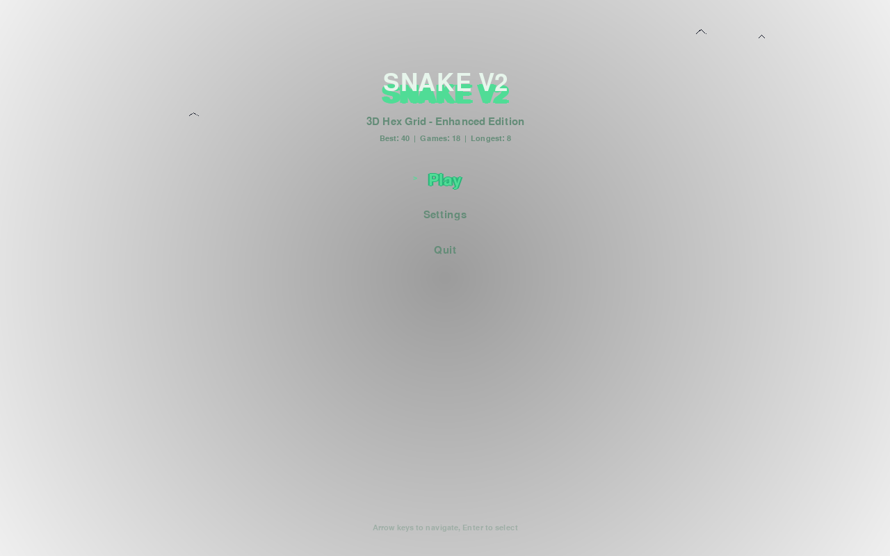
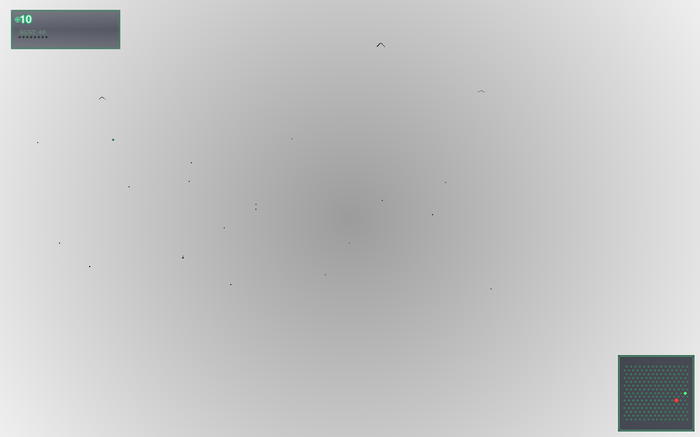
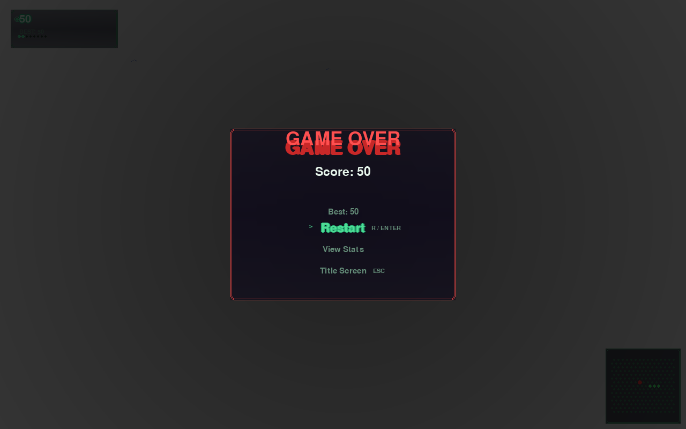

# SnakeV2

A 3D hex-grid snake game with dynamic lighting, particle effects, and atmospheric environments.

Navigate a glowing snake across a procedurally generated hexagonal island, eat apples to grow, and survive as long as you can.

## Screenshots

| Start Screen | Gameplay | Game Over |
|---|---|---|
|  |  |  |

Screenshots captured via the headless verification harness (`python dev/verify_screenshots.py`).

## Features

- **3D hex grid** — isometric projection with day/night cycle, dynamic shadows, and depth fog
- **Smooth snake movement** — Catmull-Rom spline interpolation with squash-and-stretch animations
- **Procedural environment** — perlin-noise terrain, swaying grass with flowers, ambient birds, and rolling clouds
- **Particle system** — eat bursts, movement dust, death explosions, and floating ambient motes
- **Post-processing** — bloom, tone mapping, god rays, vignette, film grain (GPU-accelerated with ModernGL)
- **Audio** — procedurally generated music, sound effects, and ambient wind/water with day/night crossfade
- **Menus & settings** — title screen, pause menu, settings (volume, post-processing toggles), game-over stats
- **Persistence** — high scores, top-5 leaderboard, lifetime stats saved automatically

## Controls

| Key | Action |
|---|---|
| A / Left Arrow | Turn left |
| D / Right Arrow | Turn right |
| Space | Pause / Resume |
| M | Toggle mute |
| F1 | Toggle debug overlay |
| F12 | Take screenshot |
| Escape | Back / Quit |

Menu navigation: Arrow keys (or mouse) + Enter.

## Installation

### Quick start

```sh
pip install pygame
python main.py
```

### With GPU acceleration (optional)

```sh
pip install moderngl
python main.py
```

### Install as a package

```sh
pip install .
# Launch from anywhere:
snakev2
```

With GL support:
```sh
pip install ".[gl]"
```

### Run from source

```sh
git clone <repo-url>
cd snakev2
pip install pygame
python main.py
```

## CLI Options

```
snakev2                Launch game (windowed)
snakev2 --fullscreen   Launch in fullscreen
snakev2 --windowed     Launch in windowed mode
snakev2 --no-gl        Disable GPU acceleration
snakev2 --version      Print version and exit
snakev2 --help         Show usage
```

## Building a standalone executable

```sh
pip install pyinstaller
python build.py
```

The executable will be created in `dist/SnakeV2`. See `build.py` for additional flags.

## Requirements

- Python 3.8+
- Pygame 2.0+
- ModernGL (optional, for GPU acceleration)

## License

MIT
